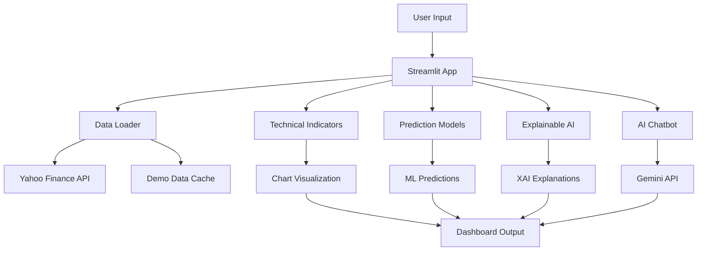

# 📁 Project Structure - Lab2 Stock Analysis System

## 🏗️ Directory Organization

```
Lab2_Stock_Analysis_System/
├── 📜 README.md                    # Main project documentation
├── 🚀 start_app.sh                 # Quick start script
├── 📋 requirements.txt             # Python dependencies
├── 🐍 .venv/                      # Virtual environment
│
├── 📂 src/                         # 💻 SOURCE CODE
│   ├── streamlit_app.py           # 🎯 Main application entry point
│   ├── data_loader.py             # 📊 Data fetching & processing
│   ├── technical_indicators.py    # 📈 Technical analysis calculations
│   ├── prediction_models.py       # 🤖 ML models implementation
│   ├── explainable_ai.py          # 🧠 XAI with SHAP/LIME
│   ├── advanced_visualization.py  # 🎨 Advanced chart generation
│   ├── chatbot_enhanced.py        # 💬 AI chatbot with Gemini
│   ├── auth_manager.py            # 🔐 Authentication system
│   └── templates/                 # 🌐 Web templates
│       ├── base.html             # Base HTML template
│       ├── dashboard.html        # Dashboard template
│       └── login.html            # Login page template
│
├── 📂 data/                        # 💾 DATA STORAGE
│   └── demo_data/                 # 📊 Sample stock datasets
│       ├── AAPL.pkl              # Apple stock data
│       ├── GOOGL.pkl             # Google stock data
│       ├── MSFT.pkl              # Microsoft stock data
│       ├── AMZN.pkl              # Amazon stock data
│       ├── NVDA.pkl              # NVIDIA stock data
│       ├── META.pkl              # Meta stock data
│       ├── TSLA.pkl              # Tesla stock data
│       ├── JPM.pkl               # JPMorgan stock data
│       ├── V.pkl                 # Visa stock data
│       └── WMT.pkl               # Walmart stock data
│
├── 📂 docs/                        # 📚 DOCUMENTATION
│   └── (To be populated)
│
├── 📂 config/                      # ⚙️ CONFIGURATION
│   └── (To be populated)
│
├── 📂 tests/                       # 🧪 TESTING
│   └── (To be populated)
│
└── 📂 outputs/                     # 📤 GENERATED OUTPUTS
    └── (Charts, reports, exports)
```

## 🔍 Key Files Description

### 🎯 Core Application Files

| File | Purpose | Key Features |
|------|---------|--------------|
| `streamlit_app.py` | Main application | 6-tab interface, session management, routing |
| `data_loader.py` | Data management | Yahoo Finance API, caching, async processing |
| `technical_indicators.py` | TA calculations | RSI, MACD, Bollinger Bands, static methods |
| `prediction_models.py` | ML models | Prophet, Random Forest, LSTM implementations |

### 🧠 AI/ML Components

| File | Purpose | Key Features |
|------|---------|--------------|
| `explainable_ai.py` | XAI implementation | SHAP, LIME, real-time explanations |
| `chatbot_enhanced.py` | AI chatbot | Gemini 2025 integration, dual API support |
| `advanced_visualization.py` | Advanced charts | 3D plots, correlation heatmaps |

### 🔧 System Components

| File | Purpose | Key Features |
|------|---------|--------------|
| `auth_manager.py` | Authentication | Session management, user validation |
| `start_app.sh` | Quick launcher | Environment check, automated startup |

## 🎨 Application Tabs Structure

### 1. 🔍 **Technical Analysis**
- **File**: `streamlit_app.py` (lines 180-400)
- **Purpose**: Stock price charts with technical indicators
- **Features**: Candlestick charts, RSI, MACD, volume analysis

### 2. 💰 **Fundamental Analysis**
- **File**: `streamlit_app.py` (lines 400-550)
- **Purpose**: Financial metrics and company analysis
- **Features**: P/E ratios, financial health, valuation metrics

### 3. 🔮 **Price Prediction**
- **File**: `streamlit_app.py` (lines 550-800)
- **Purpose**: ML-based price forecasting
- **Features**: Prophet & Random Forest models, validation metrics

### 4. 📊 **Advanced Visualization**
- **File**: `streamlit_app.py` (lines 800-950)
- **Purpose**: Sophisticated analytical charts
- **Features**: 3D analysis, correlation matrices, risk plots

### 5. 🧠 **Explainable AI**
- **File**: `streamlit_app.py` (lines 950-1200)
- **Purpose**: Model interpretability and explanation
- **Features**: 
  - 📊 Model Analysis Demo
  - 🎯 Feature Importance (SHAP)
  - 📈 Prediction Explanation (Real-time slider 0-8)
  - ⚖️ Model Comparison

### 6. 🤖 **AI Chatbot**
- **File**: `streamlit_app.py` (lines 1200-1300)
- **Purpose**: Interactive AI assistance
- **Features**: Gemini integration, stock Q&A, investment advice

## 🔄 Data Flow Architecture



## 🎯 Module Dependencies

### Core Dependencies
- `streamlit` - Web framework
- `pandas`, `numpy` - Data processing
- `plotly` - Interactive visualization
- `scikit-learn` - Machine learning

### AI/ML Dependencies
- `prophet` - Time series forecasting
- `shap` - Model explainability
- `lime` - Local interpretability
- `google-generativeai` - Gemini API

### Data Dependencies
- `yfinance` - Stock data
- `requests` - HTTP requests
- `asyncio` - Async processing

## 🚀 Quick Navigation Commands

```bash
# Navigate to project
cd /Users/vudjeuvuj84gmail.com/Downloads/STUDY/FPTU/2025/DAP391m/Lab2_Stock_Analysis_System

# Quick start
./start_app.sh

# Manual start
./.venv/bin/python -m streamlit run src/streamlit_app.py --server.port 8507

# View project structure
tree -I '.venv|__pycache__'

# Check dependencies
./.venv/bin/pip list
```

## 🎓 Academic Context

**Course**: DAP391m - Data Analytics Project  
**Lab**: Lab2 - Advanced Stock Analysis System  
**Focus**: Integration of traditional analysis with modern AI/ML and XAI  
**Learning Objectives**: Full-stack data science application development  

---

*This project structure follows best practices for academic data science projects with emphasis on code organization, documentation, and reproducibility.*